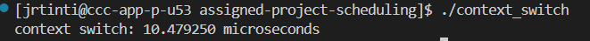

WPI username(s)

jrtinti@wpi.edu

rpblair@wpi.edu

# Context-Switch measurement methodology
    We developed a pipeline for measuring Context switching using steps from the OSTEP Book, and referencing a paper on the subject. The project involves openning a set of two pipes and using the read and write syscalls to invoke context switches. We measure the time taken over 1,000 iterations and report the average time taken to do a context switch.  

# Results
    The average time for a context switch came to be around 10 +-2 micro seconds by our measurements. 
 

# Discussion
    We are measuring the aggregate time taken to perform 1000 actions that include context switching. There are several other instructions that get generated such as setting up registers for read() and write() syscalls, or the time taken to call fork(). Both of these add additional delays to our measurements which muddle the true time taken for a context switch.

    Additionally, there are other processes running on our machines during the test. Based on what we know from modern OS's schedulers, it is not garunteed that our two processes will trade off execution perfectly. 
    
